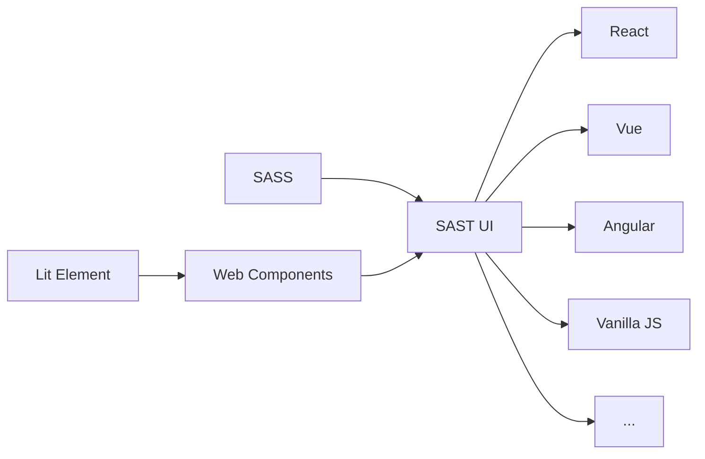

# Universal Components

This version is under development and is not yet ready for production use. It is recommended to use the React version for production projects.

## Detailed Information

This is the universal version of SAST UI, which is based on Web Components. It is designed to be used in any framework, such as React, Vue, Angular, and even vanilla JavaScript. It is fully type-safe and provides full type definitions, which can be used in TypeScript projects without any additional configuration.

All components are written in Lit Element, a lightweight base class for Web Components. It provides us with powerful tools including reactive properties, states, composition and more. It follows the W3C standards and provides a consistent and accessible user experience.

We use sass as the CSS preprocessor, and the styles are written in a modular way. You can import the styles of each component separately, or import the entire style file at once.

